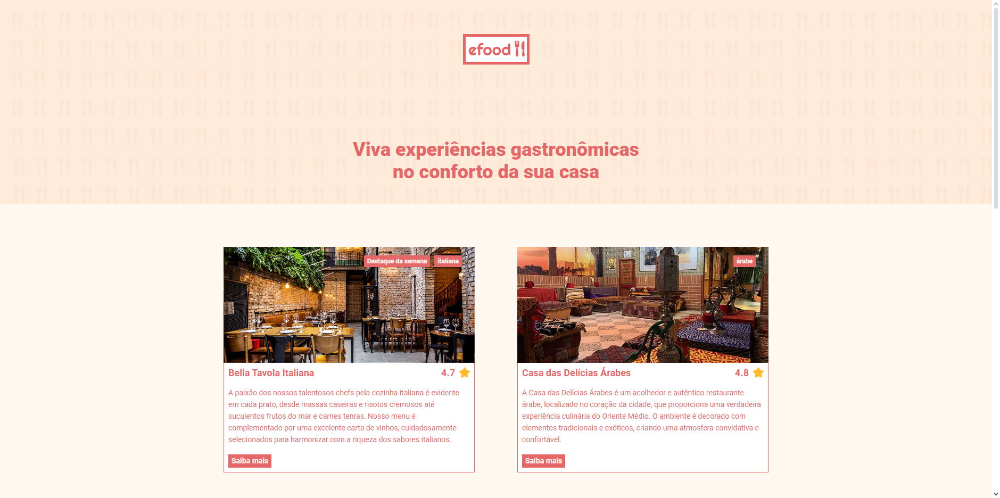
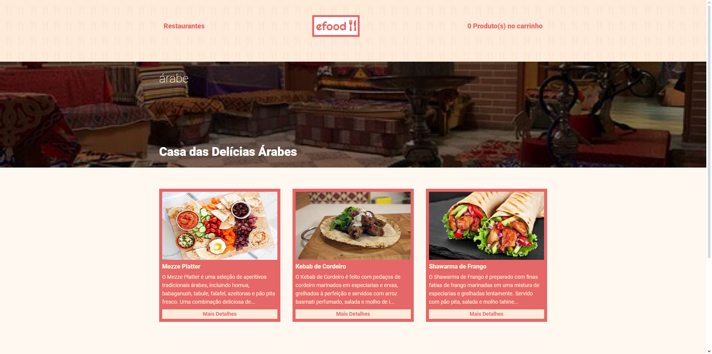
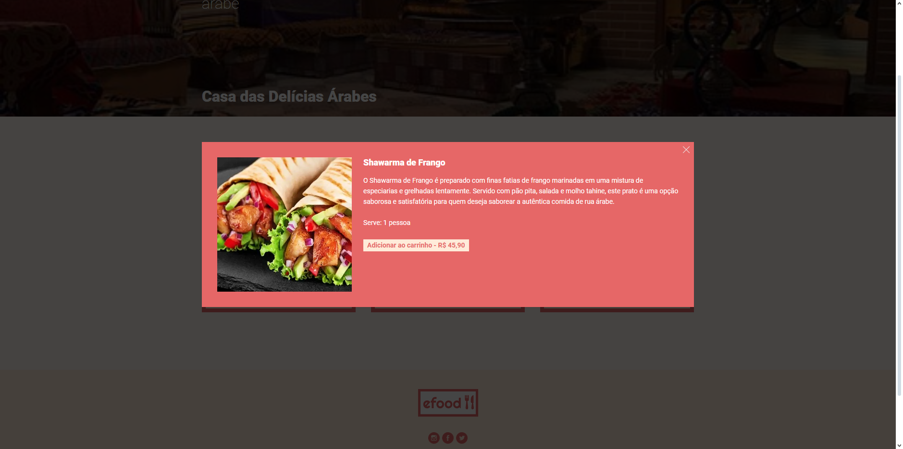
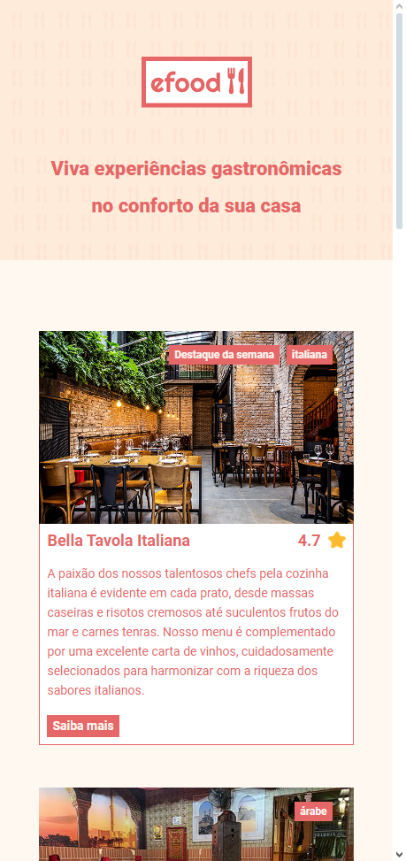
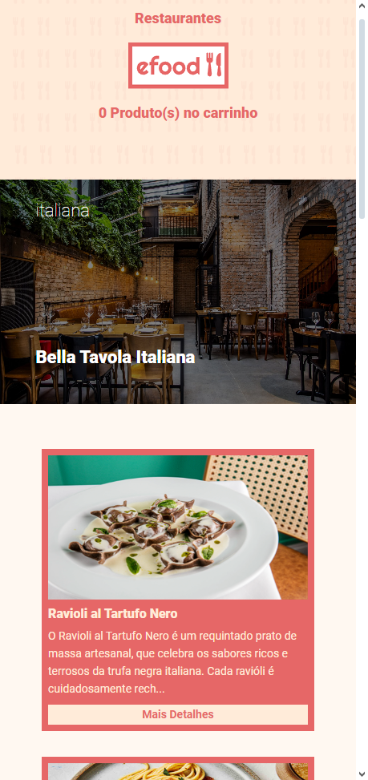
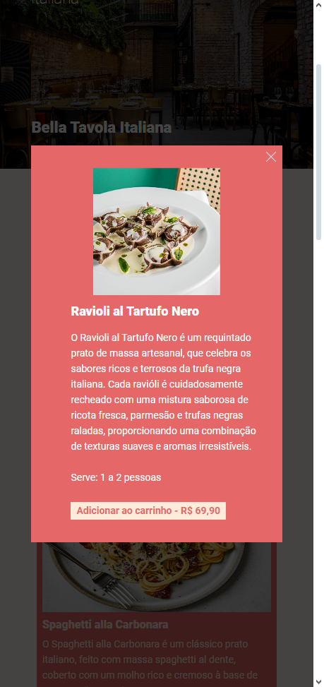

# Efood
[](https://github.com/nicolasgabriiel/Efood/blob/main/LICENSE)

# Sobre o projeto

O projeto envolve o desenvolvimento de uma página de delivery que agrega diversos restaurantes e uma ampla variedade de opções de comidas.

A página é equipada com menus detalhados com descrições e imagens dos pratos, e um carrinho de compras intuitivo. O design é responsivo, garantindo uma experiência de usuário otimizada tanto em dispositivos móveis quanto em desktops.

A página funciona consumindo e enviando dados para uma API externa.


## Design Desktop




## Design Mobile




# Tecnologias utilizadas

- React
- Typescript
- Redux
- SyledComponents

# Como executar o projeto

Pré-requisitos: npm

```bash
# clonar repositório
git clone https://github.com/nicolasgabriiel/Efood

# baixar as dependências
npm install

# executar o projeto
npm run start
```

# Autor

Nicolas Gabriel da Silva

https://www.linkedin.com/in/nicolasgabriiel/
